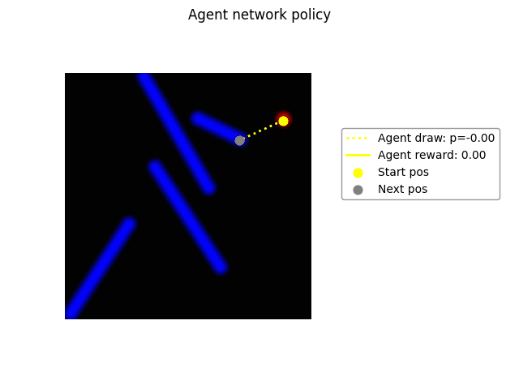
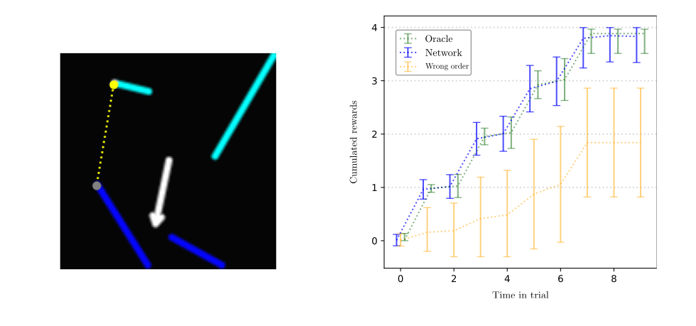

# In-Context Reinforcement Learning for hidden-rule stroke-reproduction 

This project is still under active development, see roadmap and first results below.

<p float="left">
  
  
</p>


## Key project features:
* Visual observation based RL environment.
* End-to-end hardware acceleration using Jax.
* Discrete timesteps, continuous actions.
* Composable rules : "draw each line left-to-right, starting with lines at the top", etc...
* Reward delivered upon completing a line while repecting the (hidden) rules.
* Stable context: rule maintained between trials in a "block".
* Extensive baselines and ablation studies.
* Fast to simulate, easy for humans, hard for machines.

**In-Context Learning :** rewards from one trial inform the agent's world model on the hidden rule for the block. 

Given the task's complexity, many state-of-the-art methods can be leveraged:
* Self-supervised, action-conditioned World Model for planning (JEPA).
* Reward-aware SSL for cross-trial credit assignment (Decision Transformer).
* Long-Horizon In-Context learning using temporal aggregation (Q-Chunking).
* Expressive Transformer architectures to represent multimodal stochastic policies (TRM).

# v0.3: Parametric rules
As a first-step towards compositional rules, we introduced the "draw along direction $\theta$" rule.

In this version of the environment, each reset triggers a random draw of an arrow at direction $\theta$.

Lines are ordered based on their projection along that direction, and agent receives a reward only if it respects the ordering.


Through Behavior Cloning, such policies can be represented both from the environment internal state and directly from visual observations:

<p float="left">
  
</p>


Interestingly, this parametric version of the task trains better than a variant restricted to the four cardinal directions, suggesting that the limiting factor is likely the gradient flow and not the representation capabilities of the network.

However, we find that incorporating a "decreasing order" variant of this rule (indicated by reversing the arrowhead in the visual case, and as a categorically embedded input for the decision-only one) leads to mode collapse and failure to learn the policy (each rule can be learned independently without any issue).

Therefore, out next step is to investigate ways to avoid this collapse and reach similar performance on the dual-rule task as on each subtask. Some possible solutions:
* switch from full self-attention to cross-attention (ensuring rule signal is not washed away due to its low variance).
* introduction of auxiliary losses (notably forward world-model).
* introduction of probabilistic outputs (multiple action heads, or even full canvas-sized probability heatmap).


# General roadmap 

While exact next steps will be strongly influenced by intermediate results, the broad roadmap is as follows:
1) Simultaneously represent multiple parametric rules, maintaining full observability and oracle supervision.
2) Learn such policies using On-Policy Reinforcement Learning instead of Behavior Cloning.
3) Switch to block-design, perform Behavior Cloning with "Decision Transformer"-like setup.
4) Perform full RL learning from scratch on the partially observable block-trial task.

# Running the project
This project is intended to be ran via Docker on a CUDA-enabled machine, see the [Nvidia official instructions](https://docs.nvidia.com/datacenter/cloud-native/container-toolkit/latest/install-guide.html) for help setting it up.

TPU acceleration potential will be assessed in the near future, but is not supported at the moment. 


We recommend beginning by building the image and running all tests on the target machine using:
```
make build-gpu
bash run_gpu.sh pytest tests
```
ensuring that the correct hardware is detected and that all tests are passed.

Then, experiments can be launched using:
```
bash run_gpu.sh python experiments/XX.py
```
which will bind the results folder and use it to store the outputs of the experiment.

