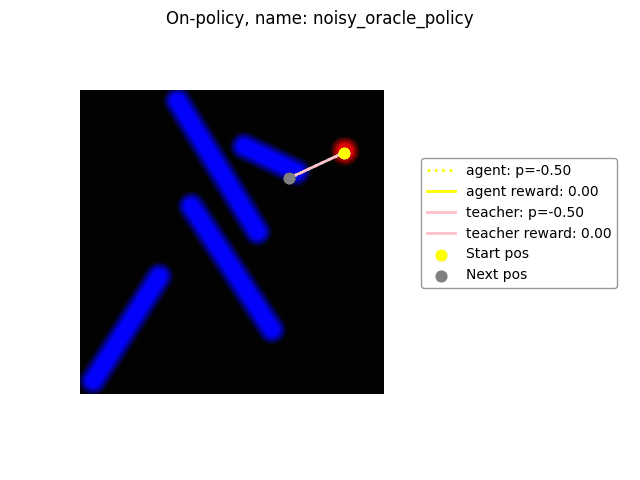
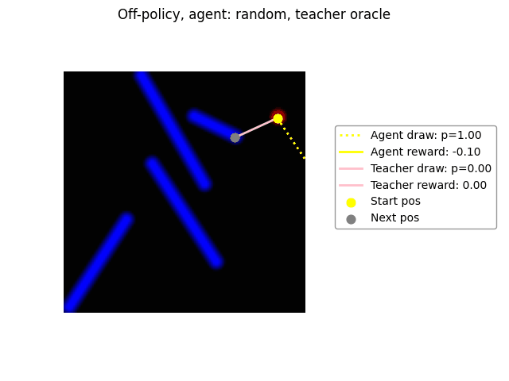
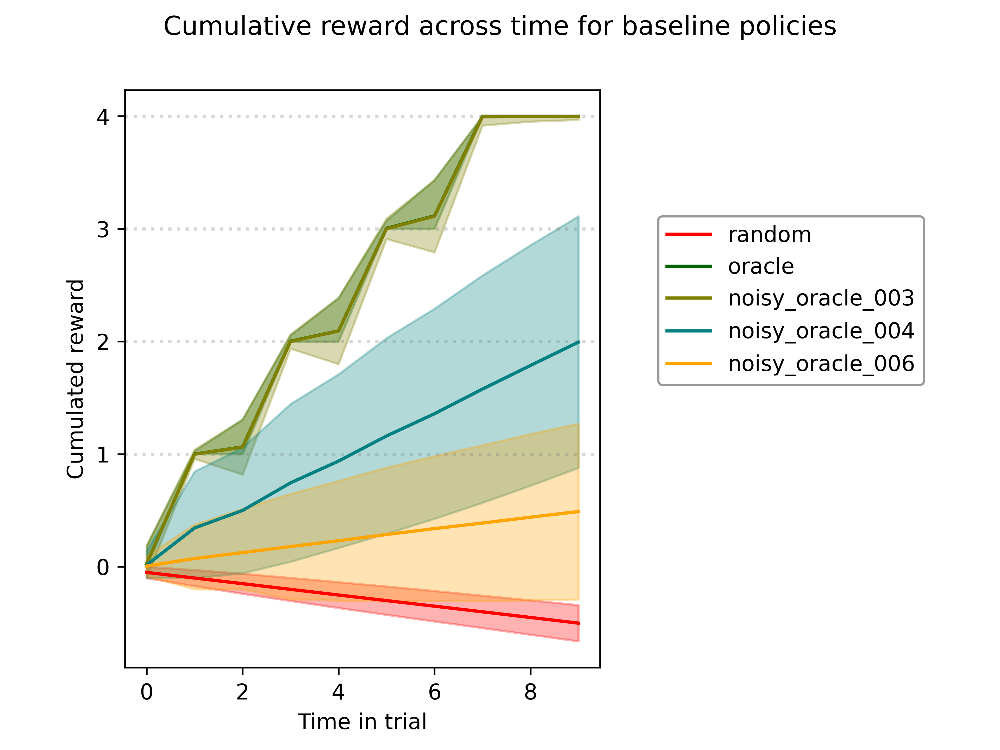

# In-Context Reinforcement Learning for hidden-rule stroke-reproduction 

This project is still in active development. 
It's goal is to adapt the setup of "stroke reproduction" used in Behavioral Neuroscience for highly efficient, hardware-accelerated simulation, and use it as a benchmark for different RL algorithms and Agent designs. 

<p float="left">
  
  
</p>


## Key environment features:
* Visual observation based RL environment
* Discrete (coarse) timesteps, continuous space for actions 
* End-to-end hardware accelerated using Jax
* Composable rules : "draw each line left-to-right, starting with lines at the top"
* Reward delivered upon completing a line while repecting the (hidden) rules.
* Stable context: rule maintained between trials in a "block" 
* Extensive baselines and ablation studies

**In-Context Learning :** rewards from one trial inform the agent's world model on the hidden rule for the block. 

Studying agents that can solve this environment, as well as the failure modes that appear after ablations, can provide information on the following questions:
* How can an agent integrate information across trials to build a "world model" ?
* How can an agent leverage an internal world model for efficient In-Context learning ?
* How can the agent perform credit assignment between trials in a block?
* What would happen if we increase time resolution (and therefore the context length) by a few orders of magnitude  ?
* What are the tradeoffs between recurrence and attention mechanism in this context ?

# Running the project
We recommend using a GPU-based machine to reproduce results, although TPUs will at least be assessed in the near future. 


We recommend beginning by running all tests on the target machine using:
```
make build-gpu
bash run_gpu.sh pytest tests
```
ensuring that the correct hardware is detected and that all tests are passed.

Then, experiments can be launched as follows, which will bind mount the results folder and use it to store the outputs of the experiment, in that case some 
trajectories rolled out from baseline policies: 
```
bash run_gpu.sh python experiments/01_baseline_policies_analysis.py
```

# Roadmap 

We expect the complete task to be quite challenging, and will therefore benefit from an an iterative development process in which the environment is progressively made more difficult as the agent's design and training procedure is adapted as needed to restore preformance. 

The broad roadmap is as follows:
1) Perform Behavior Cloning of an Oracle policy on a single-rule (hence, fully observable) environment.
2) Introduce multiple rules, while maintaining full observability and oracle supervision.
3) Learn both earlier variants using On-Policy Reinforcement Learning instead of Behavior Cloning.
4) Switch to block-design, perform Behavior Cloning with "Decision Transformer"-like setup.
5) Perform full RL learning from scratch on the partially observable block-trial task.


# v0.1: First baselines
* 4 strokes per canvas
* No hidden rules, any well-drawn stroke is rewarded (+1), bad strokes penalized (-0.1) 
* Oracle policy (reads env internals) : move to closest line-end, then push the pen and move to the other.
* Noisy versions of the oracle add random gaussian noise on the movement 
* Measure cumulative reward within one trial (over 64*512 trials) 

<p align="center">
  
</p>


